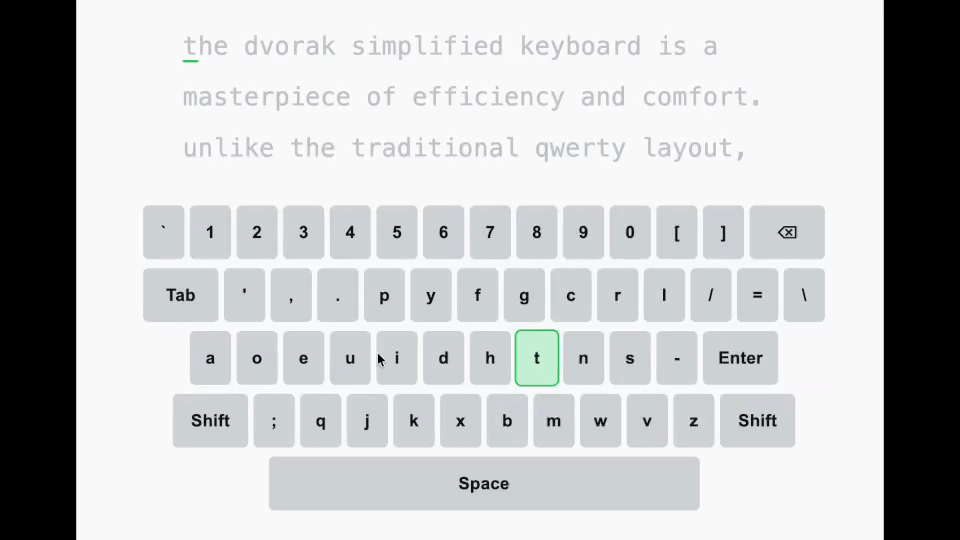

# Dvorak Typing Game — v2

> **Note**: 現在、Antigravityのgemini3を使ってリファクタリングを進めています。

このプロジェクトは VS Code と Codex（Codex CLI）を使ってすべて実装しました。ブラウザで動作する US Dvorak 専用のタイピング練習アプリで、仮想キーボードは Wordle 風の見た目を踏襲しつつ、練習体験をシンプルに最適化しています。最新版ではローカルの任意テキストをその場で読み込んで練習できるようになり、著作物をリポジトリに含めずに利用できます。

---

## Dvorak Typing




---

## 主な特長
- **Dvorak 最適化 UI**: 数字行・記号・Shift/Tab/Space/Backspace を含む US Dvorak 配列を仮想キーボードで再現。
- **Shift 連動表示**: 物理/仮想どちらの Shift 操作でもキーラベルを即時切り替え（数字→記号、英字→大文字）。
- **リアルタイムフィードバック**: 押下キーを一瞬ハイライトし、入力結果（正解/ミス/未入力）を色で明示。
- **任意テキスト読み込み**: ヘッダーのファイル選択から `.txt` を読み込むだけで、その場でタイピング課題を生成。
- **Monkeytype 風スペース挙動**: スペースキーで次単語へジャンプ。未入力の文字は自動でミス扱いにしてテンポよく練習可能。
- **キーマップ PDF ダウンロード**: Dvorak 配列のキーマップを A4 PDF としてダウンロード可能。印刷して手元で参照できます。
- **軽量構成**: Vanilla HTML/CSS/JS のみ。ビルド不要で即実行。

---

## 使い方
1. リポジトリ内の `index.html` をダブルクリック、または任意のブラウザで開きます。  
   - 推奨はローカルサーバー起動：
     ```bash
     # Python
     python3 -m http.server 5173
     # Node.js
     npx http-server -p 5173
     ```
     → [http://localhost:5173](http://localhost:5173) でアクセスできます。
2. 画面上部の「ファイルを選択」で `.txt` を読み込むと、その内容が 3 行表示の課題として展開されます。
3. 表示された行をタイプします。単語の途中でスペースキーを押すと次の単語へスキップし、未入力箇所はミスとして処理されます。
4. 行末で自動的に次の課題へ移行します。
5. ヘッダー右上から **Dvorak 配列 PDF** をダウンロード可能です。
6. 仮想キーボードはクリック入力にも対応しているので、配列確認や練習用に活用できます。

### 推奨ワークフロー（長文教材を使う場合）
- 手元の書き起こしや教材テキストをそのまま `.txt` で用意し、段落ごとに見出し（例: `## Talk 01`）を挿入すると分割しやすくなります。
- まとめ直しスクリプトを使いたい場合は `scripts/compile-texts.js` を実行すると、`文字列/` 以下のファイルを英語行のみ抽出して `compiled/` へ 10セット単位で書き出せます（著作物はリポジトリには含めない運用を推奨）。

---

## ディレクトリ構成
- `index.html` — レイアウトと操作UI（タイトル、ファイル選択、配列ダウンロードボタン）。
- `main.js` — 仮想キーボード生成、ファイル読み込み、Monkeytype 風スペース挙動、文字列レイアウト。
- `style.css` — 画面全体の配色・レイアウト・仮想キーのスタイル。
- `assets/` — Dvorak 配列の A4 PDF など、共有可能なリソース。
- `scripts/compile-texts.js`（任意） — 大量の書き起こしをまとめるための補助スクリプト。著作物テキストは別管理としてください。
- `demo.gif` — タイピングデモ（README 用に配置）。

---

## 開発メモ
- すべてのコードは Codex CLI から生成・編集しています。
- HTML/CSS/JS の簡潔な構成を維持しているため、カスタマイズや拡張が容易です。
- 更新時はブラウザのキャッシュを無効化してリロードすると最新の `main.js` が確実に反映されます。

---

## 今後のアイデア
- WPM/精度の計測と表示
- 練習履歴のローカル保存
- Programmer Dvorak/JIS Dvorak など配列切替
- テキストの章立て自動解析、タグ別フィルタリング

---

Dvorak 配列の指運びを大切にしながら、手元の教材で効率よく練習してください。改善案やプルリクエストも歓迎です。