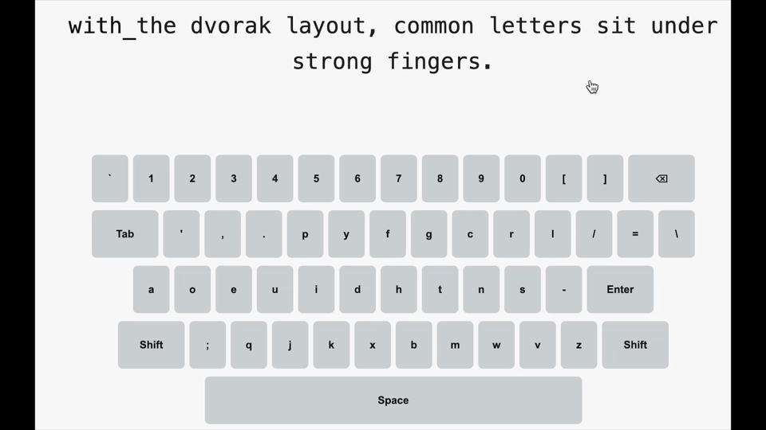

# Dvorak Typing Game — v1

VS Code と Codex（Codex CLI）で作成した、ブラウザで動く Dvorak 専用のタイピング練習アプリです。キーボードは Wordle 風の見た目ですが、ゲーム性はシンプルなタイピング練習に特化。Dvorak の指運びを保ちつつ、英文と CLI（コマンドライン）の両方を効率よく練習できます。

## 特長（Why this）
- Dvorak最適化: US Dvorak 配列をフル再現（数字・記号・Shift/Tab/Space/Backspace 付き）。
- Shift連動表示: Shift 有効中は全行のラベルが即座に切替（数字→記号、英字→大文字）。物理/画面の Shift どちらも連動。
- 打鍵フィードバック: 押下キーのみを一瞬ハイライト。次に進むと自動で消灯（一般的タイピング挙動）。
- 練習モード: ヘッダーの「練習モード」で切替。
  - 英文（小文字・Dvorakの利点を説明する短文）
  - CLI（`git`/`ls`/`grep`/`docker`/`npm` など実用コマンド）
- 軽量: HTML/CSS/JS（Vanilla）のみ。ビルド不要、即起動。

## 使い方（Getting Started）
- `index.html` をブラウザで開くだけで動作します。
  - ローカルサーバ例: `python3 -m http.server 8000`
- 上部のテキストを順にタイプ。完了すると自動で次の課題へ。
- ヘッダー右側の「練習モード」で「英文 / CLI」を切替可能です。

### 配列ダウンロード（印刷推奨）
- 画面右上の「Dvorak配列DL」ボタンから、A4印刷用PDF（2ページ）をダウンロードできます。
- 印刷して手元に置き、配列を見ながら練習すると習得しやすいです。

## デモ

### 操作（ショート）
- `Backspace`: 1文字戻る
- `Tab`: 半角スペース2つ（画面/物理）
- `Shift`: 有効中は数字→記号、英字→大文字表示に切替（物理/画面の両方に連動）
- 画面キー: `Shift / Tab / Space / Backspace` を含めクリック入力可能

## 配列仕様（US Dvorak）
- 数字行: `` ` 1 2 3 4 5 6 7 8 9 0 [ ] ``（右端に Backspace）。Shift で `~ ! @ # $ % ^ & * ( ) { }`。
- 上段: `Tab` ＋ `' , . p y f g c r l / = \`
- 中段: `a o e u i d h t n s -`（右端に `Enter`）
- 下段: 左`Shift` ＋ `; q j k x b m w v z` ＋ 右`Shift`
- 下部: `Space`（ワイド）

> 注: 本実装は US Dvorak 準拠です。JIS配列や Programmer Dvorak への切替は将来対応として拡張可能です。

## リポジトリ構成
- `index.html`: 画面レイアウトとコントロール類
- `style.css`: 配色とレイアウト（Wordle風キー、Shiftアクティブ表示、レスポンシブ）
- `main.js`:
  - キーボード生成（フル Dvorak）
  - Shiftの物理/仮想連動とラベル切替
  - タイピング判定と一時ハイライト、練習モード切替
  - 出題テキストの管理（英文/CLI）

## カスタマイズ（Customize）
- 練習テキストを編集:
  - 英文: `main.js` の `EXERCISES_EN`
  - CLI: `main.js` の `EXERCISES_CLI`
- 配列を編集:
  - 数字行: `DVORAK_NUMBER_ROW`
  - 上段: `DVORAK_ROW1` / 中段: `DVORAK_ROW2` / 下段: `DVORAK_ROW3`
- 見た目を調整: `style.css` の CSS 変数や `.key` の高さ/幅を変更

## Dvorak 練習のコツ（Notes）
- 正確性を優先: まずはノーミスでの完了を目標に。
- ホームポジション固定: 母音（左）と頻出子音（右）の配置を意識し、移動距離を最小化。
- 短時間・高頻度: 1日 10〜15 分 × 複数回が効果的。
- 句読点も早期練習: `, . - / = \ ; [ ]` を含む短文で運指を固める。

## 既知の制限（Known Limitations）
- 物理配列の切替は OS 依存（本アプリは表示/入力ロジックを Dvorak に揃えています）。
- モバイルではキーが狭くなる場合あり。
- アクセシビリティ対応は最小限（今後改善予定）。

## ロードマップ（Roadmap / Ideas）
- 練習セット拡充（レベル別、頻度ベース、実務フレーズ）
- Programmer Dvorak / JIS Dvorak 切替
- WPM/精度/連続正解の計測・保存（ローカル）
- セッション統計、日次目標、連続日数トラッキング
- 効果音・アニメーションのオプション

## 開発メモ
- VS Code と Codex（Codex CLI）で作成。Vanilla の HTML/CSS/JS 構成で変更容易。
- 変更反映時はキャッシュ無効リロード推奨（特に `main.js`）。

## バージョン情報
- v1: Dvorak フル配列（数字/記号/Shift連動）、英文/CLI モード、打鍵時の一時ハイライト、シームレス背景、中央配置 UI を実装。

---
改善提案や練習文・コマンドの追加案を歓迎します。Dvorak の気持ちよさを一緒に磨きましょう。
